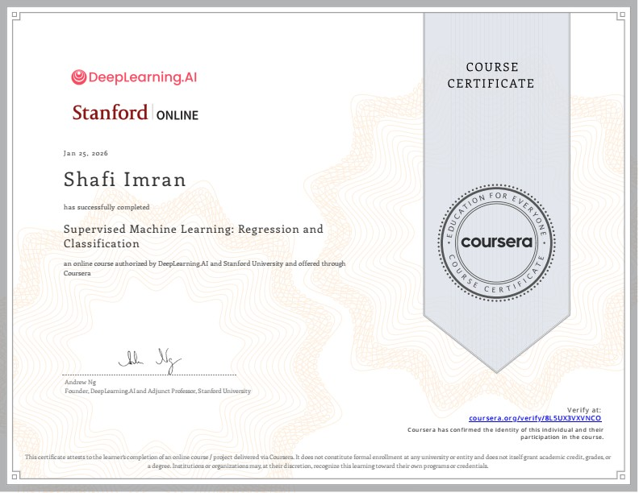

  

    <a href="https://coursera.org/share/3089cd8ba9e5749c51050064351c5e49" target="_blank">
      
      
Machine Learning Specialization

    </a>
  

  

    <a href="https://coursera.org/share/3089cd8ba9e5749c51050064351c5e49" target="_blank">
      
      
Supervised Machine Learning

    </a>
  

  

    <a href="https://coursera.org/share/3089cd8ba9e5749c51050064351c5e49" target="_blank">
      
      
Advanced Learning Algorithms

    </a>
  

  

    <a href="https://coursera.org/share/3089cd8ba9e5749c51050064351c5e49" target="_blank">
      
      
Unsupervised Learning, Recommenders, Reinforcement Learning

    </a>
  

  

    <a href="https://codebasics.io/certificate/CB-BT-1-449152" target="_blank">
      
      
Data Analytics Bootcamp

    </a>
  

  

    <a href="https://coursera.org/share/385f9036a00bfad500f828c0985ebafe" target="_blank">
      
      
Mathematics for ML & Data Science

    </a>
  

  

    <a href="https://codebasics.io/certificate/CB-48-449152" target="_blank">
      
      
Python: Beginner to Advanced

    </a>
  

  

    <a href="https://codebasics.io/certificate/CB-50-449152" target="_blank">
      
      
SQL: Beginner to Advanced

    </a>
  

  

    <a href="https://codebasics.io/certificate/CB-49-449152" target="_blank">
      
      
Power BI Data Analytics

    </a>
  

